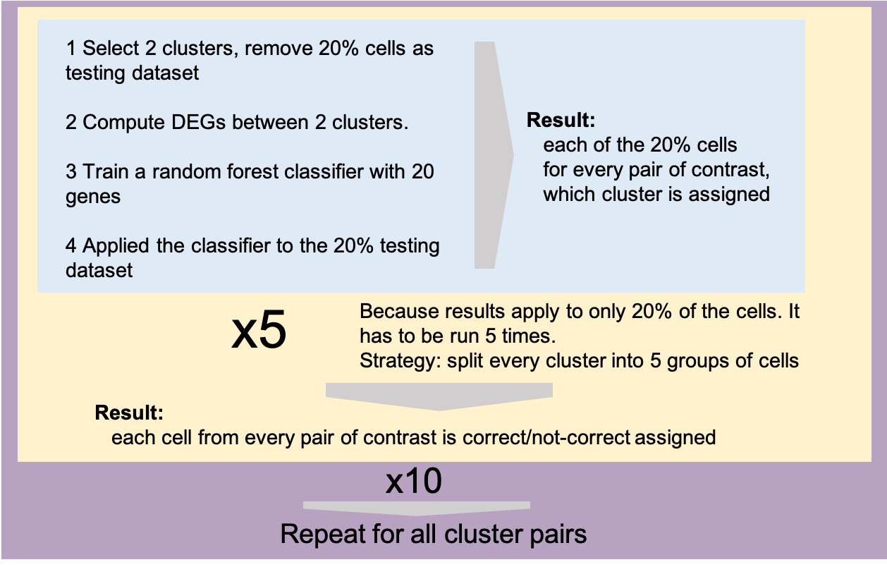

# BMN characterization
This repository is a summary of codes used in  [_Deep deconvolution of the hematopoietic stem cell regulatory microenvironment reveals a high degree of specialization and conservation between mouse and human_](https://www.biorxiv.org/content/10.1101/2021.07.17.452614v1).

### Preprocessing and Integration
The cells were filtered and integrated using Seurat

### Clustering

### Bootstrapping

To measure the robustness of the clusters, we customized an existing bootstrapping-based approach based on random forest [[REF1]](#ref1). See details below.

###### Workflow of the bootstrapping strategy:

###### Output
To quantify the robustness of each cluster, we formulated two evaluation metrics: for each cell, we computed “how many times it has been correctly assigned to the cluster proposed” (recall per cell in Fig.2), and for each cluster, we quantified “how many times and how many cells are correctly assigned” (e.g. in Fig.3, more than 80% of the cells are correctly assigned to the proposed clusters in all six comparisons for cluster A2.1);

### Reference
  1. Tasic, B. et al. Adult mouse cortical cell taxonomy revealed by single cell transcriptomics. Nat. Neurosci. 19, 335–346 (2016).

 
