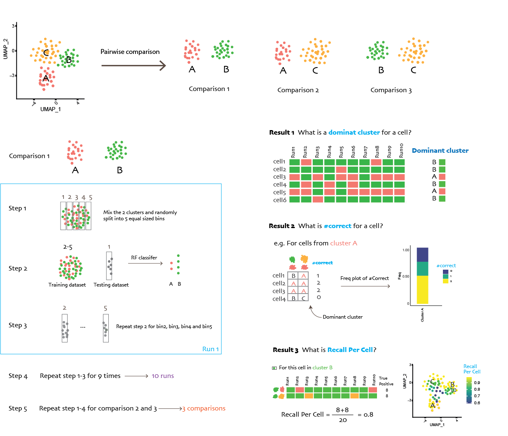

# BMN characterization
This repository is a summary of codes used in  [_Deep deconvolution of the hematopoietic stem cell regulatory microenvironment reveals a high degree of specialization and conservation between mouse and human_](https://www.biorxiv.org/content/10.1101/2021.07.17.452614v1).

### Preprocessing, Integration and Clustering
The cells were filtered and integrated using Seurat. A divide-and-conqur strategy was applied using IKAP[[REF1]](#ref1). Core script is [Clustering.R](R_code/Clustering.R)

### Bootstrapping

To measure the robustness of the clusters, we customized an existing bootstrapping-based approach based on random forest [[REF2]](#ref2). See details below.

###### Summary of the bootstrapping strategy:

  
-  *Dominate cluster identification*:  A dominant cluster is the cluster to which the cell is assigned for more than half the runs.
- *Number of Correct Dominance Assignment (#Correct)*: The sum of times the dominant cluster matches the original cluster (true positive) for a cell across all cluster pair comparisons.
-	*Recall Per Cell*: The proportion of correct assignment (positive result) to its original cluster in all runs from all comparisons.

###### Usage of bootstrapping methods
see [Using_Bootstrapping_functions.R](R_code/Using_Bootstrapping_functions.R)

#### Compare mouse and human BMN
Human samples were filtered in the same way with mouse, except
- the mt.percent threshold is 10% instead of 5%
- cells with more than 10% of Immunoglobin protein were removed.   

[singleR.R](R_code/singleR.R) shows the comparison of mouse and human EC/MSCs using singleR.

### Added values
To show that the integration method provide more information than a single dataset.
- Added value 1: Comparing the DEGs defined by individual dataset and integrated dataset.
  See [Added_value1.R](R_code/Added_value1.R)

- Added value 2: Cluster stability evaluation for individual dataset.  
  Apply Bootstrapping function to each individual dataset while maintaining the cluster label to see if the cluster defined by one dataset is robust enough.

- Added value 3: Comparing cluster identified by a single dataset.   
  To further understand if the clusters can be identified by one dataset only, Baryawno dataset was used as an example considering its large cell populations. Clustering+bootstrapping functions were applied to Scadden(Baryawno) dataset.

### Reference
  1. Mischnik, Marcel, et al. "IKAP: A heuristic framework for inference of kinase activities from Phosphoproteomics data." Bioinformatics 32.3 (2016): 424-431 .     
  2. Tasic, B. et al. Adult mouse cortical cell taxonomy revealed by single cell transcriptomics. Nat. Neurosci. 19, 335–346 (2016).
